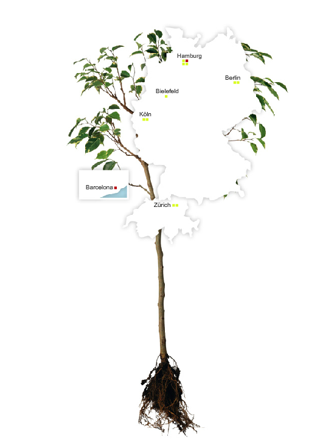

% Practical Lessons from Building a Highly Available OpenStack Private Cloud
% Sebastian Kachel, Florian Haas
% Fall 2013 OpenStack Summit, Hong Kong, November 7, 2013

This presentation is **licensed** under the
[Creative Commons Attribution-ShareAlike 3.0 Unported License](http://creativecommons.org/licenses/by-sa/3.0/).

Get the **sources** on GitHub:

* <https://github.com/basti-kachel/openstacknov2013-practicallessons>
* <https://github.com/fghaas/openstacknov2013-practicallessons>

# What's this about?

Solution from pixelpark`s high availability private Cloud 

# Who are we?

## Sebastian Kachel 
	
IT Cloud-Manager / IT Operator

Seasoned Unix/Linux sysadmin/devops guy who became involved in
OpenStack in 2012, when his company decided to lauch an OpenStack
private cloud. 

Based in Berlin, Germany, he is one of the movers and shakers of all
things OpenStack at Pixelpark.

	
## Florian Haas

TODO: Add a few works about Florian

# What was our challenge to solve?

## Ensure high availability for all services that we want use for our customers

Must start with high availability at the base of the system (IaaS)

# Why OpenStack?

## Pixelpark AG 
	
### Full-service agency for multimedia communications & e-business solutions
	
**departments:** concepts, project management, editorial, design,
  development & hosting

## Challenges

* Hosting department needs benefits of cloud computing (automation &
  process optimization, standardization, … )
  
* cloud software that is/become more than IaaS, that can be use by
  other departments like development

* OpenStack is the best base for Pixelpark as a full-service agency

## Why high availability ?

* We provide our customers service level agreement with high
  availability up to 99,99 %.

# How did we do it?

## Highly available storage

* Highly available storage as base as data store to bring it 
* to 24 x 7 days per week / 365 days in year online
* scalable 

## Why Ceph?

* Ceph is a distributed object store and file system designed to provide excellent performance, reliability and scalability
* storage to store data with no datalost
* store cinder volumes, glance images, static data (S3) over radosgw, instances
* All data are high available

!picture with logical functionality (3 node)!

## How did we build our Ceph store?

* working with 3 copies
* filesystem xfs
* 1TB Disk per OSD / 6 OSD per Node
* osd-journaling on seperate ssd 
* storage node with 8 x 1GBit/s Ports in trunk mode

## Highly available networking

#### quantum-dhcp & l3-agent scalable over two nodes and pacemakercluster to monitor & control network services 

## Highly available OpenStack services and APIs

!picture pacemaker!

#### Pacemakercluster with two controller nodes to bring horizon, keystone, glance, nova, rabbitmq, quantum-server & mysql database everytime online

!picture HA-Controller-Nodes! 

1. active-backup (distributed)
2. database in drdb 
3. rabbitmg in drdb
4. Raid 1 under drbd

## Highly available Nova guests

#### to bring high availability in all services, we lets run instances in ceph-cluster too
#### pacemaker cluster for nova services 

!picture HA-Compute-Node!

1. rbd mount unter /var/lib/nova/instances
2. ocfs2 filesystem 
3. own pool in ceph-cluster 
4. need good network connection to storages
5. 6 x 1GBit/s Ports on every compute

# How did this affect our organization?

# Get in touch!
