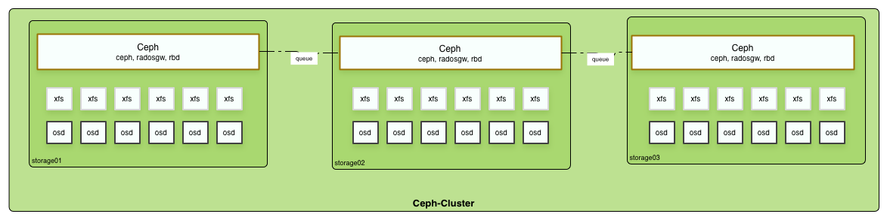
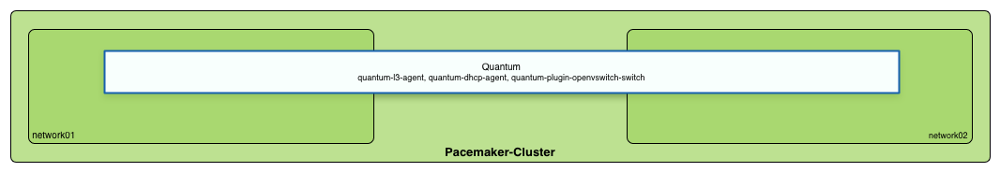
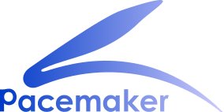
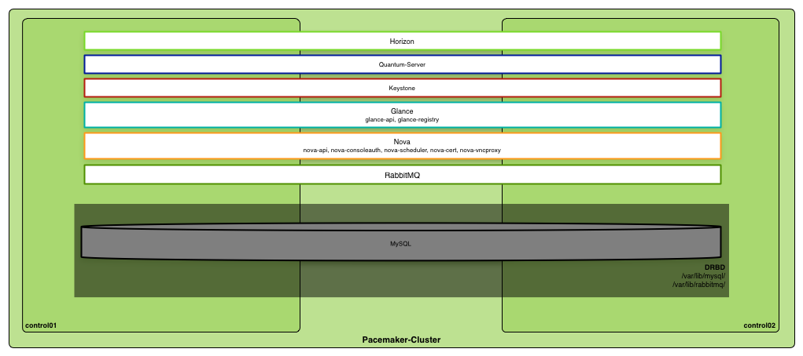
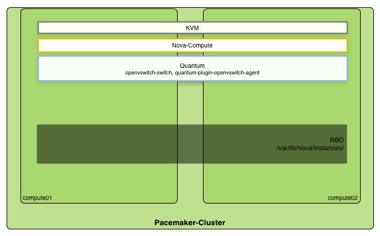

% Practical Lessons from Building a Highly Available OpenStack Private Cloud
% Sebastian Kachel, Florian Haas
% Fall 2013 OpenStack Summit, Hong Kong, November 7, 2013

This presentation is **licensed** under the
[Creative Commons Attribution-ShareAlike 3.0 Unported License](http://creativecommons.org/licenses/by-sa/3.0/).

Get the **sources** on GitHub:

* <https://github.com/basti-kachel/openstacknov2013-practicallessons>
* <https://github.com/fghaas/openstacknov2013-practicallessons>

# What's this about?

Solution from pixelpark`s high availability private Cloud 

# Who are we?

## Sebastian Kachel 
	
IT Cloud-Manager / IT Operator

Seasoned Unix/Linux sysadmin/devops guy who became involved in
OpenStack in 2012, when his company decided to lauch an OpenStack
private cloud. 

Based in Berlin, Germany, he is one of the movers and shakers of all
things OpenStack at Pixelpark.

	
## Florian Haas

TODO: Add a few works about Florian

# What was our challenge to solve?

## Ensure high availability for all services that we want use for our customers

# Why OpenStack?

## Pixelpark AG 
	
### Full-service agency for multimedia communications & e-business solutions
	
**departments:** concepts, project management, editorial, design,
  development & hosting

## Challenges

* Hosting department needs benefits of cloud computing
  
* cloud software that is/become more than IaaS, that can be use by
  other departments like PaaS for development

* OpenStack is the best base for Pixelpark as a full-service agency

## Why high availability ?

* We provide our customers service level agreement with high
  availability up to 99,99 %.

# How did we do it?

## Highly available storage

* Highly available storage as base data store to make it scale

## Why Ceph?

* Ceph is a distributed object store and file system designed to
  provide excellent performance, reliability and scalability

* Guarantees reliable storage with no data loss

* Stores: Cinder volumes, Glance images, static data (S3) over radosgw
  & instances

* Ceph is an excellent, reliable basis for cloud storage

## How did we build our Ceph store?

* Working with 3 copies

* 1 disk per OSD

* XFS filesystem
 
* Journal on separate SSD
 
* Storage nodes with 8 x 1GBit/s Ports in trunk mode

## Highly available networking

* quantum-dhcp-agent & quantum-l3-agent scalable over two nodes and pacemakercluster
  to monitor & control network services
  

  
* quantum-dhcp active/active over two nodes managed by pacemaker

* quantum-l3-agent active/backup over two nodes managed by pacemaker

* quantum-plugin-openvswitch-agent active/active over two nodes managed by pacemaker

## Highly available OpenStack services and APIs

* Pacemaker cluster with two controller nodes to bring horizon,
  keystone, glance, nova, rabbitmq, quantum-server & mysql database
  everytime online
  

* active-backup (distributed)

* mysql / rabbitmg stored in drdb 

* Raid 1 under drbd

## Highly available Nova guests

* to bring high availability in all services, we lets run instances in
  ceph-cluster, too
  
* services are manage by pacemaker  

* rbd mount under /var/lib/nova/instances
* own pool in ceph-cluster 
* ocfs2 filesystem 
* need good network connection to storages
* 6 x 1GBit/s Ports on every compute

# How did this affect our organization?

* not easy to implement an openstack environment 
* good way to got training & support by hastexo 
* save quality & work efficient
* further innovation
* have a top base for comming technologies
* make fun to work with it

# Get in touch!

# Thank you !
